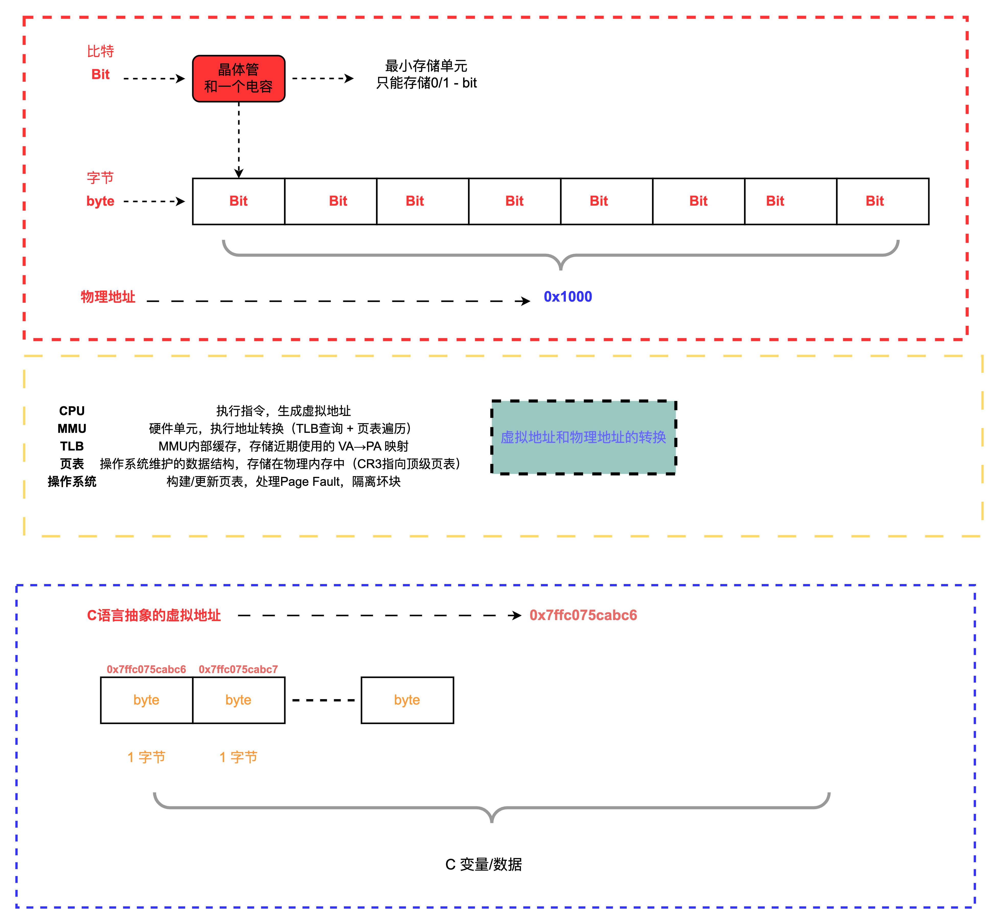
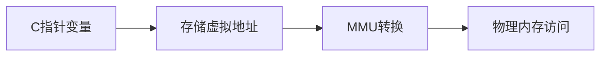

#### **1. 内存基础：比特与字节**

✅ 内存与底层硬件示意图：



- 图中底层正确展示：
  - 比特（Bit）是基本信息单位（0/1），由晶体管和电容存储
  - 8比特构成1字节（Byte），字节是内存最小可寻址单位

```c
// C语言验证：字符类型占1字节
printf("char size: %zu byte\n", sizeof(char));  // 输出 1
```

------

#### **2. 物理地址 vs 虚拟地址**

- CPU通过**虚拟地址**访问内存

- MMU硬件执行转换：

  ```mermaid
  graph LR
  CPU生成虚拟地址 --> MMU --> TLB缓存查询 --> 页表遍历 --> 物理地址
  ```

  <svg id="svgGraph71929028915440" width="100%" xmlns="http://www.w3.org/2000/svg" class="flowchart" style="overflow: hidden; max-width: 100%;" role="graphics-document document" aria-roledescription="flowchart-v2" xmlns:xlink="http://www.w3.org/1999/xlink" xmlns:ev="http://www.w3.org/2001/xml-events"><g id="viewport-20250629080415239" class="svg-pan-zoom_viewport" transform="matrix(0.9115329672369833,0,0,0.9115329672369833,65.9172899666872,131.2424792109486)" style="transform: matrix(0.911533, 0, 0, 0.911533, 65.91729, 131.242479);"><g><marker id="svgGraph71929028915440_flowchart-v2-pointEnd" class="marker flowchart-v2" viewBox="0 0 10 10" refX="5" refY="5" markerUnits="userSpaceOnUse" markerWidth="8" markerHeight="8" orient="auto"><path d="M 0 0 L 10 5 L 0 10 z" class="arrowMarkerPath" style="stroke-width: 1; stroke-dasharray: 1, 0;"></path></marker><marker id="svgGraph71929028915440_flowchart-v2-pointStart" class="marker flowchart-v2" viewBox="0 0 10 10" refX="4.5" refY="5" markerUnits="userSpaceOnUse" markerWidth="8" markerHeight="8" orient="auto"><path d="M 0 5 L 10 10 L 10 0 z" class="arrowMarkerPath" style="stroke-width: 1; stroke-dasharray: 1, 0;"></path></marker><marker id="svgGraph71929028915440_flowchart-v2-circleEnd" class="marker flowchart-v2" viewBox="0 0 10 10" refX="11" refY="5" markerUnits="userSpaceOnUse" markerWidth="11" markerHeight="11" orient="auto"><circle cx="5" cy="5" r="5" class="arrowMarkerPath" style="stroke-width: 1; stroke-dasharray: 1, 0;"></circle></marker><marker id="svgGraph71929028915440_flowchart-v2-circleStart" class="marker flowchart-v2" viewBox="0 0 10 10" refX="-1" refY="5" markerUnits="userSpaceOnUse" markerWidth="11" markerHeight="11" orient="auto"><circle cx="5" cy="5" r="5" class="arrowMarkerPath" style="stroke-width: 1; stroke-dasharray: 1, 0;"></circle></marker><marker id="svgGraph71929028915440_flowchart-v2-crossEnd" class="marker cross flowchart-v2" viewBox="0 0 11 11" refX="12" refY="5.2" markerUnits="userSpaceOnUse" markerWidth="11" markerHeight="11" orient="auto"><path d="M 1,1 l 9,9 M 10,1 l -9,9" class="arrowMarkerPath" style="stroke-width: 2; stroke-dasharray: 1, 0;"></path></marker><marker id="svgGraph71929028915440_flowchart-v2-crossStart" class="marker cross flowchart-v2" viewBox="0 0 11 11" refX="-1" refY="5.2" markerUnits="userSpaceOnUse" markerWidth="11" markerHeight="11" orient="auto"><path d="M 1,1 l 9,9 M 10,1 l -9,9" class="arrowMarkerPath" style="stroke-width: 2; stroke-dasharray: 1, 0;"></path></marker><g class="root"><g class="clusters"></g><g class="edgePaths"><path d="M192.875,35L197.042,35C201.208,35,209.542,35,217.208,35C224.875,35,231.875,35,235.375,35L238.875,35" id="L_CPU生成虚拟地址_MMU_0" class="edge-thickness-normal edge-pattern-solid edge-thickness-normal edge-pattern-solid flowchart-link" style="" marker-end="url(#svgGraph71929028915440_flowchart-v2-pointEnd)"></path><path d="M335.953,35L340.12,35C344.286,35,352.62,35,360.286,35C367.953,35,374.953,35,378.453,35L381.953,35" id="L_MMU_TLB缓存查询_0" class="edge-thickness-normal edge-pattern-solid edge-thickness-normal edge-pattern-solid flowchart-link" style="" marker-end="url(#svgGraph71929028915440_flowchart-v2-pointEnd)"></path><path d="M536.406,35L540.573,35C544.74,35,553.073,35,560.74,35C568.406,35,575.406,35,578.906,35L582.406,35" id="L_TLB缓存查询_页表遍历_0" class="edge-thickness-normal edge-pattern-solid edge-thickness-normal edge-pattern-solid flowchart-link" style="" marker-end="url(#svgGraph71929028915440_flowchart-v2-pointEnd)"></path><path d="M710.406,35L714.573,35C718.74,35,727.073,35,734.74,35C742.406,35,749.406,35,752.906,35L756.406,35" id="L_页表遍历_物理地址_0" class="edge-thickness-normal edge-pattern-solid edge-thickness-normal edge-pattern-solid flowchart-link" style="" marker-end="url(#svgGraph71929028915440_flowchart-v2-pointEnd)"></path></g><g class="edgeLabels"><g class="edgeLabel"><g class="label" transform="translate(0, 0)"><foreignObject width="0" height="0"><div xmlns="http://www.w3.org/1999/xhtml" class="labelBkg" style="margin: 0px; padding: 0px; border: 0px; font-style: inherit; font-variant-caps: inherit; font-weight: inherit; font-stretch: inherit; font-size: inherit; line-height: 1.5; font-family: inherit; font-size-adjust: inherit; font-kerning: inherit; font-variant-alternates: inherit; font-variant-ligatures: inherit; font-variant-numeric: inherit; font-variant-east-asian: inherit; font-variant-position: inherit; font-variant-emoji: inherit; font-feature-settings: inherit; font-optical-sizing: inherit; font-variation-settings: inherit; vertical-align: baseline; background-color: rgba(88, 88, 88, 0.5); display: table-cell; white-space: nowrap; max-width: 200px; text-align: center;"><span class="edgeLabel" style="margin: 0px; padding: 0px; border: 0px; font-style: inherit; font-variant-caps: inherit; font-weight: inherit; font-stretch: inherit; font-size: inherit; line-height: inherit; font-family: inherit !important; font-size-adjust: inherit; font-kerning: inherit; font-variant-alternates: inherit; font-variant-ligatures: inherit; font-variant-numeric: inherit; font-variant-east-asian: inherit; font-variant-position: inherit; font-variant-emoji: inherit; font-feature-settings: inherit; font-optical-sizing: inherit; font-variation-settings: inherit; vertical-align: baseline; fill: rgb(204, 204, 204); color: rgb(204, 204, 204); background-color: rgb(88, 88, 88); text-align: center;"></span></div></foreignObject></g></g><g class="edgeLabel"><g class="label" transform="translate(0, 0)"><foreignObject width="0" height="0"><div xmlns="http://www.w3.org/1999/xhtml" class="labelBkg" style="margin: 0px; padding: 0px; border: 0px; font-style: inherit; font-variant-caps: inherit; font-weight: inherit; font-stretch: inherit; font-size: inherit; line-height: 1.5; font-family: inherit; font-size-adjust: inherit; font-kerning: inherit; font-variant-alternates: inherit; font-variant-ligatures: inherit; font-variant-numeric: inherit; font-variant-east-asian: inherit; font-variant-position: inherit; font-variant-emoji: inherit; font-feature-settings: inherit; font-optical-sizing: inherit; font-variation-settings: inherit; vertical-align: baseline; background-color: rgba(88, 88, 88, 0.5); display: table-cell; white-space: nowrap; max-width: 200px; text-align: center;"><span class="edgeLabel" style="margin: 0px; padding: 0px; border: 0px; font-style: inherit; font-variant-caps: inherit; font-weight: inherit; font-stretch: inherit; font-size: inherit; line-height: inherit; font-family: inherit !important; font-size-adjust: inherit; font-kerning: inherit; font-variant-alternates: inherit; font-variant-ligatures: inherit; font-variant-numeric: inherit; font-variant-east-asian: inherit; font-variant-position: inherit; font-variant-emoji: inherit; font-feature-settings: inherit; font-optical-sizing: inherit; font-variation-settings: inherit; vertical-align: baseline; fill: rgb(204, 204, 204); color: rgb(204, 204, 204); background-color: rgb(88, 88, 88); text-align: center;"></span></div></foreignObject></g></g><g class="edgeLabel"><g class="label" transform="translate(0, 0)"><foreignObject width="0" height="0"><div xmlns="http://www.w3.org/1999/xhtml" class="labelBkg" style="margin: 0px; padding: 0px; border: 0px; font-style: inherit; font-variant-caps: inherit; font-weight: inherit; font-stretch: inherit; font-size: inherit; line-height: 1.5; font-family: inherit; font-size-adjust: inherit; font-kerning: inherit; font-variant-alternates: inherit; font-variant-ligatures: inherit; font-variant-numeric: inherit; font-variant-east-asian: inherit; font-variant-position: inherit; font-variant-emoji: inherit; font-feature-settings: inherit; font-optical-sizing: inherit; font-variation-settings: inherit; vertical-align: baseline; background-color: rgba(88, 88, 88, 0.5); display: table-cell; white-space: nowrap; max-width: 200px; text-align: center;"><span class="edgeLabel" style="margin: 0px; padding: 0px; border: 0px; font-style: inherit; font-variant-caps: inherit; font-weight: inherit; font-stretch: inherit; font-size: inherit; line-height: inherit; font-family: inherit !important; font-size-adjust: inherit; font-kerning: inherit; font-variant-alternates: inherit; font-variant-ligatures: inherit; font-variant-numeric: inherit; font-variant-east-asian: inherit; font-variant-position: inherit; font-variant-emoji: inherit; font-feature-settings: inherit; font-optical-sizing: inherit; font-variation-settings: inherit; vertical-align: baseline; fill: rgb(204, 204, 204); color: rgb(204, 204, 204); background-color: rgb(88, 88, 88); text-align: center;"></span></div></foreignObject></g></g><g class="edgeLabel"><g class="label" transform="translate(0, 0)"><foreignObject width="0" height="0"><div xmlns="http://www.w3.org/1999/xhtml" class="labelBkg" style="margin: 0px; padding: 0px; border: 0px; font-style: inherit; font-variant-caps: inherit; font-weight: inherit; font-stretch: inherit; font-size: inherit; line-height: 1.5; font-family: inherit; font-size-adjust: inherit; font-kerning: inherit; font-variant-alternates: inherit; font-variant-ligatures: inherit; font-variant-numeric: inherit; font-variant-east-asian: inherit; font-variant-position: inherit; font-variant-emoji: inherit; font-feature-settings: inherit; font-optical-sizing: inherit; font-variation-settings: inherit; vertical-align: baseline; background-color: rgba(88, 88, 88, 0.5); display: table-cell; white-space: nowrap; max-width: 200px; text-align: center;"><span class="edgeLabel" style="margin: 0px; padding: 0px; border: 0px; font-style: inherit; font-variant-caps: inherit; font-weight: inherit; font-stretch: inherit; font-size: inherit; line-height: inherit; font-family: inherit !important; font-size-adjust: inherit; font-kerning: inherit; font-variant-alternates: inherit; font-variant-ligatures: inherit; font-variant-numeric: inherit; font-variant-east-asian: inherit; font-variant-position: inherit; font-variant-emoji: inherit; font-feature-settings: inherit; font-optical-sizing: inherit; font-variation-settings: inherit; vertical-align: baseline; fill: rgb(204, 204, 204); color: rgb(204, 204, 204); background-color: rgb(88, 88, 88); text-align: center;"></span></div></foreignObject></g></g></g><g class="nodes"><g class="node default" id="flowchart-CPU生成虚拟地址-0" transform="translate(100.4375, 35)"><rect class="basic label-container" style="" x="-92.4375" y="-27" width="184.875" height="54"></rect><g class="label" style="" transform="translate(-62.4375, -12)"><rect></rect><foreignObject width="124.875" height="24"><div xmlns="http://www.w3.org/1999/xhtml" style="margin: 0px; padding: 0px; border: 0px; font-style: inherit; font-variant-caps: inherit; font-weight: inherit; font-stretch: inherit; font-size: inherit; line-height: 1.5; font-family: inherit; font-size-adjust: inherit; font-kerning: inherit; font-variant-alternates: inherit; font-variant-ligatures: inherit; font-variant-numeric: inherit; font-variant-east-asian: inherit; font-variant-position: inherit; font-variant-emoji: inherit; font-feature-settings: inherit; font-optical-sizing: inherit; font-variation-settings: inherit; vertical-align: baseline; display: table-cell; white-space: nowrap; max-width: 200px; text-align: center;"><span class="nodeLabel" style="margin: 0px; padding: 0px; border: 0px; font-style: inherit; font-variant-caps: inherit; font-weight: inherit; font-stretch: inherit; font-size: inherit; line-height: inherit; font-family: inherit !important; font-size-adjust: inherit; font-kerning: inherit; font-variant-alternates: inherit; font-variant-ligatures: inherit; font-variant-numeric: inherit; font-variant-east-asian: inherit; font-variant-position: inherit; font-variant-emoji: inherit; font-feature-settings: inherit; font-optical-sizing: inherit; font-variation-settings: inherit; vertical-align: baseline; fill: rgb(204, 204, 204); color: rgb(204, 204, 204);"><p style="margin: 0px; padding: 0px; border: 0px; font-style: inherit; font-variant-caps: inherit; font-weight: 400; font-stretch: inherit; font-size: 16px; line-height: 1.75; font-family: inherit; font-size-adjust: inherit; font-kerning: inherit; font-variant-alternates: inherit; font-variant-ligatures: inherit; font-variant-numeric: inherit; font-variant-east-asian: inherit; font-variant-position: inherit; font-variant-emoji: inherit; font-feature-settings: inherit; font-optical-sizing: inherit; font-variation-settings: inherit; vertical-align: baseline; word-break: break-word; overflow-wrap: break-word;">CPU生成虚拟地址</p></span></div></foreignObject></g></g><g class="node default" id="flowchart-MMU-1" transform="translate(289.4140625, 35)"><rect class="basic label-container" style="" x="-46.5390625" y="-27" width="93.078125" height="54"></rect><g class="label" style="" transform="translate(-16.5390625, -12)"><rect></rect><foreignObject width="33.078125" height="24"><div xmlns="http://www.w3.org/1999/xhtml" style="margin: 0px; padding: 0px; border: 0px; font-style: inherit; font-variant-caps: inherit; font-weight: inherit; font-stretch: inherit; font-size: inherit; line-height: 1.5; font-family: inherit; font-size-adjust: inherit; font-kerning: inherit; font-variant-alternates: inherit; font-variant-ligatures: inherit; font-variant-numeric: inherit; font-variant-east-asian: inherit; font-variant-position: inherit; font-variant-emoji: inherit; font-feature-settings: inherit; font-optical-sizing: inherit; font-variation-settings: inherit; vertical-align: baseline; display: table-cell; white-space: nowrap; max-width: 200px; text-align: center;"><span class="nodeLabel" style="margin: 0px; padding: 0px; border: 0px; font-style: inherit; font-variant-caps: inherit; font-weight: inherit; font-stretch: inherit; font-size: inherit; line-height: inherit; font-family: inherit !important; font-size-adjust: inherit; font-kerning: inherit; font-variant-alternates: inherit; font-variant-ligatures: inherit; font-variant-numeric: inherit; font-variant-east-asian: inherit; font-variant-position: inherit; font-variant-emoji: inherit; font-feature-settings: inherit; font-optical-sizing: inherit; font-variation-settings: inherit; vertical-align: baseline; fill: rgb(204, 204, 204); color: rgb(204, 204, 204);"><p style="margin: 0px; padding: 0px; border: 0px; font-style: inherit; font-variant-caps: inherit; font-weight: 400; font-stretch: inherit; font-size: 16px; line-height: 1.75; font-family: inherit; font-size-adjust: inherit; font-kerning: inherit; font-variant-alternates: inherit; font-variant-ligatures: inherit; font-variant-numeric: inherit; font-variant-east-asian: inherit; font-variant-position: inherit; font-variant-emoji: inherit; font-feature-settings: inherit; font-optical-sizing: inherit; font-variation-settings: inherit; vertical-align: baseline; word-break: break-word; overflow-wrap: break-word;">MMU</p></span></div></foreignObject></g></g><g class="node default" id="flowchart-TLB缓存查询-2" transform="translate(461.1796875, 35)"><rect class="basic label-container" style="" x="-75.2265625" y="-27" width="150.453125" height="54"></rect><g class="label" style="" transform="translate(-45.2265625, -12)"><rect></rect><foreignObject width="90.453125" height="24"><div xmlns="http://www.w3.org/1999/xhtml" style="margin: 0px; padding: 0px; border: 0px; font-style: inherit; font-variant-caps: inherit; font-weight: inherit; font-stretch: inherit; font-size: inherit; line-height: 1.5; font-family: inherit; font-size-adjust: inherit; font-kerning: inherit; font-variant-alternates: inherit; font-variant-ligatures: inherit; font-variant-numeric: inherit; font-variant-east-asian: inherit; font-variant-position: inherit; font-variant-emoji: inherit; font-feature-settings: inherit; font-optical-sizing: inherit; font-variation-settings: inherit; vertical-align: baseline; display: table-cell; white-space: nowrap; max-width: 200px; text-align: center;"><span class="nodeLabel" style="margin: 0px; padding: 0px; border: 0px; font-style: inherit; font-variant-caps: inherit; font-weight: inherit; font-stretch: inherit; font-size: inherit; line-height: inherit; font-family: inherit !important; font-size-adjust: inherit; font-kerning: inherit; font-variant-alternates: inherit; font-variant-ligatures: inherit; font-variant-numeric: inherit; font-variant-east-asian: inherit; font-variant-position: inherit; font-variant-emoji: inherit; font-feature-settings: inherit; font-optical-sizing: inherit; font-variation-settings: inherit; vertical-align: baseline; fill: rgb(204, 204, 204); color: rgb(204, 204, 204);"><p style="margin: 0px; padding: 0px; border: 0px; font-style: inherit; font-variant-caps: inherit; font-weight: 400; font-stretch: inherit; font-size: 16px; line-height: 1.75; font-family: inherit; font-size-adjust: inherit; font-kerning: inherit; font-variant-alternates: inherit; font-variant-ligatures: inherit; font-variant-numeric: inherit; font-variant-east-asian: inherit; font-variant-position: inherit; font-variant-emoji: inherit; font-feature-settings: inherit; font-optical-sizing: inherit; font-variation-settings: inherit; vertical-align: baseline; word-break: break-word; overflow-wrap: break-word;">TLB缓存查询</p></span></div></foreignObject></g></g><g class="node default" id="flowchart-页表遍历-3" transform="translate(648.40625, 35)"><rect class="basic label-container" style="" x="-62" y="-27" width="124" height="54"></rect><g class="label" style="" transform="translate(-32, -12)"><rect></rect><foreignObject width="64" height="24"><div xmlns="http://www.w3.org/1999/xhtml" style="margin: 0px; padding: 0px; border: 0px; font-style: inherit; font-variant-caps: inherit; font-weight: inherit; font-stretch: inherit; font-size: inherit; line-height: 1.5; font-family: inherit; font-size-adjust: inherit; font-kerning: inherit; font-variant-alternates: inherit; font-variant-ligatures: inherit; font-variant-numeric: inherit; font-variant-east-asian: inherit; font-variant-position: inherit; font-variant-emoji: inherit; font-feature-settings: inherit; font-optical-sizing: inherit; font-variation-settings: inherit; vertical-align: baseline; display: table-cell; white-space: nowrap; max-width: 200px; text-align: center;"><span class="nodeLabel" style="margin: 0px; padding: 0px; border: 0px; font-style: inherit; font-variant-caps: inherit; font-weight: inherit; font-stretch: inherit; font-size: inherit; line-height: inherit; font-family: inherit !important; font-size-adjust: inherit; font-kerning: inherit; font-variant-alternates: inherit; font-variant-ligatures: inherit; font-variant-numeric: inherit; font-variant-east-asian: inherit; font-variant-position: inherit; font-variant-emoji: inherit; font-feature-settings: inherit; font-optical-sizing: inherit; font-variation-settings: inherit; vertical-align: baseline; fill: rgb(204, 204, 204); color: rgb(204, 204, 204);"><p style="margin: 0px; padding: 0px; border: 0px; font-style: inherit; font-variant-caps: inherit; font-weight: 400; font-stretch: inherit; font-size: 16px; line-height: 1.75; font-family: inherit; font-size-adjust: inherit; font-kerning: inherit; font-variant-alternates: inherit; font-variant-ligatures: inherit; font-variant-numeric: inherit; font-variant-east-asian: inherit; font-variant-position: inherit; font-variant-emoji: inherit; font-feature-settings: inherit; font-optical-sizing: inherit; font-variation-settings: inherit; vertical-align: baseline; word-break: break-word; overflow-wrap: break-word;">页表遍历</p></span></div></foreignObject></g></g><g class="node default" id="flowchart-物理地址-4" transform="translate(822.40625, 35)"><rect class="basic label-container" style="" x="-62" y="-27" width="124" height="54"></rect><g class="label" style="" transform="translate(-32, -12)"><rect></rect><foreignObject width="64" height="24"><div xmlns="http://www.w3.org/1999/xhtml" style="margin: 0px; padding: 0px; border: 0px; font-style: inherit; font-variant-caps: inherit; font-weight: inherit; font-stretch: inherit; font-size: inherit; line-height: 1.5; font-family: inherit; font-size-adjust: inherit; font-kerning: inherit; font-variant-alternates: inherit; font-variant-ligatures: inherit; font-variant-numeric: inherit; font-variant-east-asian: inherit; font-variant-position: inherit; font-variant-emoji: inherit; font-feature-settings: inherit; font-optical-sizing: inherit; font-variation-settings: inherit; vertical-align: baseline; display: table-cell; white-space: nowrap; max-width: 200px; text-align: center;"><span class="nodeLabel" style="margin: 0px; padding: 0px; border: 0px; font-style: inherit; font-variant-caps: inherit; font-weight: inherit; font-stretch: inherit; font-size: inherit; line-height: inherit; font-family: inherit !important; font-size-adjust: inherit; font-kerning: inherit; font-variant-alternates: inherit; font-variant-ligatures: inherit; font-variant-numeric: inherit; font-variant-east-asian: inherit; font-variant-position: inherit; font-variant-emoji: inherit; font-feature-settings: inherit; font-optical-sizing: inherit; font-variation-settings: inherit; vertical-align: baseline; fill: rgb(204, 204, 204); color: rgb(204, 204, 204);"><p style="margin: 0px; padding: 0px; border: 0px; font-style: inherit; font-variant-caps: inherit; font-weight: 400; font-stretch: inherit; font-size: 16px; line-height: 1.75; font-family: inherit; font-size-adjust: inherit; font-kerning: inherit; font-variant-alternates: inherit; font-variant-ligatures: inherit; font-variant-numeric: inherit; font-variant-east-asian: inherit; font-variant-position: inherit; font-variant-emoji: inherit; font-feature-settings: inherit; font-optical-sizing: inherit; font-variation-settings: inherit; vertical-align: baseline; word-break: break-word; overflow-wrap: break-word;">物理地址</p></span></div></foreignObject></g></g></g></g></g></g></svg>

- 操作系统维护页表（CR3寄存器指向顶级页表）

💡 **关键认知**：

* **C语言看到的地址都是虚拟地址！​**​
  * 例如：`0x7ffc075cabc6` 是进程内存空间的虚拟地址

------

#### **3. C指针的本质**

- 指针变量存储**虚拟地址**
- 内存访问通过虚拟地址实现

```c
int num = 42;
int *ptr = &num;  // ptr存储num的虚拟地址

printf("指针值：%p\n", ptr);  // 输出类似 0x7ffc075cabc6
printf("指向的值：%d\n", *ptr);  // 通过虚拟地址访问物理内存
```

##### 指针操作的核心原理：



<svg id="svgGraph26027589873850" width="100%" xmlns="http://www.w3.org/2000/svg" class="flowchart" style="overflow: hidden; max-width: 100%;" role="graphics-document document" aria-roledescription="flowchart-v2" xmlns:xlink="http://www.w3.org/1999/xlink" xmlns:ev="http://www.w3.org/2001/xml-events"><g id="viewport-20250629080423765" class="svg-pan-zoom_viewport" transform="matrix(1.1504052567605683,0,0,1.1504052567605683,59.87502621187563,123.83743854895118)" style="transform: matrix(1.150405, 0, 0, 1.150405, 59.875026, 123.837439);"><g><marker id="svgGraph26027589873850_flowchart-v2-pointEnd" class="marker flowchart-v2" viewBox="0 0 10 10" refX="5" refY="5" markerUnits="userSpaceOnUse" markerWidth="8" markerHeight="8" orient="auto"><path d="M 0 0 L 10 5 L 0 10 z" class="arrowMarkerPath" style="stroke-width: 1; stroke-dasharray: 1, 0;"></path></marker><marker id="svgGraph26027589873850_flowchart-v2-pointStart" class="marker flowchart-v2" viewBox="0 0 10 10" refX="4.5" refY="5" markerUnits="userSpaceOnUse" markerWidth="8" markerHeight="8" orient="auto"><path d="M 0 5 L 10 10 L 10 0 z" class="arrowMarkerPath" style="stroke-width: 1; stroke-dasharray: 1, 0;"></path></marker><marker id="svgGraph26027589873850_flowchart-v2-circleEnd" class="marker flowchart-v2" viewBox="0 0 10 10" refX="11" refY="5" markerUnits="userSpaceOnUse" markerWidth="11" markerHeight="11" orient="auto"><circle cx="5" cy="5" r="5" class="arrowMarkerPath" style="stroke-width: 1; stroke-dasharray: 1, 0;"></circle></marker><marker id="svgGraph26027589873850_flowchart-v2-circleStart" class="marker flowchart-v2" viewBox="0 0 10 10" refX="-1" refY="5" markerUnits="userSpaceOnUse" markerWidth="11" markerHeight="11" orient="auto"><circle cx="5" cy="5" r="5" class="arrowMarkerPath" style="stroke-width: 1; stroke-dasharray: 1, 0;"></circle></marker><marker id="svgGraph26027589873850_flowchart-v2-crossEnd" class="marker cross flowchart-v2" viewBox="0 0 11 11" refX="12" refY="5.2" markerUnits="userSpaceOnUse" markerWidth="11" markerHeight="11" orient="auto"><path d="M 1,1 l 9,9 M 10,1 l -9,9" class="arrowMarkerPath" style="stroke-width: 2; stroke-dasharray: 1, 0;"></path></marker><marker id="svgGraph26027589873850_flowchart-v2-crossStart" class="marker cross flowchart-v2" viewBox="0 0 11 11" refX="-1" refY="5.2" markerUnits="userSpaceOnUse" markerWidth="11" markerHeight="11" orient="auto"><path d="M 1,1 l 9,9 M 10,1 l -9,9" class="arrowMarkerPath" style="stroke-width: 2; stroke-dasharray: 1, 0;"></path></marker><g class="root"><g class="clusters"></g><g class="edgePaths"><path d="M141.578,35L145.745,35C149.911,35,158.245,35,165.911,35C173.578,35,180.578,35,184.078,35L187.578,35" id="L_A_B_0" class="edge-thickness-normal edge-pattern-solid edge-thickness-normal edge-pattern-solid flowchart-link" style="" marker-end="url(#svgGraph26027589873850_flowchart-v2-pointEnd)"></path><path d="M347.578,35L351.745,35C355.911,35,364.245,35,371.911,35C379.578,35,386.578,35,390.078,35L393.578,35" id="L_B_C_0" class="edge-thickness-normal edge-pattern-solid edge-thickness-normal edge-pattern-solid flowchart-link" style="" marker-end="url(#svgGraph26027589873850_flowchart-v2-pointEnd)"></path><path d="M522.656,35L526.823,35C530.99,35,539.323,35,546.99,35C554.656,35,561.656,35,565.156,35L568.656,35" id="L_C_D_0" class="edge-thickness-normal edge-pattern-solid edge-thickness-normal edge-pattern-solid flowchart-link" style="" marker-end="url(#svgGraph26027589873850_flowchart-v2-pointEnd)"></path></g><g class="edgeLabels"><g class="edgeLabel"><g class="label" transform="translate(0, 0)"><foreignObject width="0" height="0"><div xmlns="http://www.w3.org/1999/xhtml" class="labelBkg" style="margin: 0px; padding: 0px; border: 0px; font-style: inherit; font-variant-caps: inherit; font-weight: inherit; font-stretch: inherit; font-size: inherit; line-height: 1.5; font-family: inherit; font-size-adjust: inherit; font-kerning: inherit; font-variant-alternates: inherit; font-variant-ligatures: inherit; font-variant-numeric: inherit; font-variant-east-asian: inherit; font-variant-position: inherit; font-variant-emoji: inherit; font-feature-settings: inherit; font-optical-sizing: inherit; font-variation-settings: inherit; vertical-align: baseline; background-color: rgba(88, 88, 88, 0.5); display: table-cell; white-space: nowrap; max-width: 200px; text-align: center;"><span class="edgeLabel" style="margin: 0px; padding: 0px; border: 0px; font-style: inherit; font-variant-caps: inherit; font-weight: inherit; font-stretch: inherit; font-size: inherit; line-height: inherit; font-family: inherit !important; font-size-adjust: inherit; font-kerning: inherit; font-variant-alternates: inherit; font-variant-ligatures: inherit; font-variant-numeric: inherit; font-variant-east-asian: inherit; font-variant-position: inherit; font-variant-emoji: inherit; font-feature-settings: inherit; font-optical-sizing: inherit; font-variation-settings: inherit; vertical-align: baseline; fill: rgb(204, 204, 204); color: rgb(204, 204, 204); background-color: rgb(88, 88, 88); text-align: center;"></span></div></foreignObject></g></g><g class="edgeLabel"><g class="label" transform="translate(0, 0)"><foreignObject width="0" height="0"><div xmlns="http://www.w3.org/1999/xhtml" class="labelBkg" style="margin: 0px; padding: 0px; border: 0px; font-style: inherit; font-variant-caps: inherit; font-weight: inherit; font-stretch: inherit; font-size: inherit; line-height: 1.5; font-family: inherit; font-size-adjust: inherit; font-kerning: inherit; font-variant-alternates: inherit; font-variant-ligatures: inherit; font-variant-numeric: inherit; font-variant-east-asian: inherit; font-variant-position: inherit; font-variant-emoji: inherit; font-feature-settings: inherit; font-optical-sizing: inherit; font-variation-settings: inherit; vertical-align: baseline; background-color: rgba(88, 88, 88, 0.5); display: table-cell; white-space: nowrap; max-width: 200px; text-align: center;"><span class="edgeLabel" style="margin: 0px; padding: 0px; border: 0px; font-style: inherit; font-variant-caps: inherit; font-weight: inherit; font-stretch: inherit; font-size: inherit; line-height: inherit; font-family: inherit !important; font-size-adjust: inherit; font-kerning: inherit; font-variant-alternates: inherit; font-variant-ligatures: inherit; font-variant-numeric: inherit; font-variant-east-asian: inherit; font-variant-position: inherit; font-variant-emoji: inherit; font-feature-settings: inherit; font-optical-sizing: inherit; font-variation-settings: inherit; vertical-align: baseline; fill: rgb(204, 204, 204); color: rgb(204, 204, 204); background-color: rgb(88, 88, 88); text-align: center;"></span></div></foreignObject></g></g><g class="edgeLabel"><g class="label" transform="translate(0, 0)"><foreignObject width="0" height="0"><div xmlns="http://www.w3.org/1999/xhtml" class="labelBkg" style="margin: 0px; padding: 0px; border: 0px; font-style: inherit; font-variant-caps: inherit; font-weight: inherit; font-stretch: inherit; font-size: inherit; line-height: 1.5; font-family: inherit; font-size-adjust: inherit; font-kerning: inherit; font-variant-alternates: inherit; font-variant-ligatures: inherit; font-variant-numeric: inherit; font-variant-east-asian: inherit; font-variant-position: inherit; font-variant-emoji: inherit; font-feature-settings: inherit; font-optical-sizing: inherit; font-variation-settings: inherit; vertical-align: baseline; background-color: rgba(88, 88, 88, 0.5); display: table-cell; white-space: nowrap; max-width: 200px; text-align: center;"><span class="edgeLabel" style="margin: 0px; padding: 0px; border: 0px; font-style: inherit; font-variant-caps: inherit; font-weight: inherit; font-stretch: inherit; font-size: inherit; line-height: inherit; font-family: inherit !important; font-size-adjust: inherit; font-kerning: inherit; font-variant-alternates: inherit; font-variant-ligatures: inherit; font-variant-numeric: inherit; font-variant-east-asian: inherit; font-variant-position: inherit; font-variant-emoji: inherit; font-feature-settings: inherit; font-optical-sizing: inherit; font-variation-settings: inherit; vertical-align: baseline; fill: rgb(204, 204, 204); color: rgb(204, 204, 204); background-color: rgb(88, 88, 88); text-align: center;"></span></div></foreignObject></g></g></g><g class="nodes"><g class="node default" id="flowchart-A-0" transform="translate(74.7890625, 35)"><rect class="basic label-container" style="" x="-66.7890625" y="-27" width="133.578125" height="54"></rect><g class="label" style="" transform="translate(-36.7890625, -12)"><rect></rect><foreignObject width="73.578125" height="24"><div xmlns="http://www.w3.org/1999/xhtml" style="margin: 0px; padding: 0px; border: 0px; font-style: inherit; font-variant-caps: inherit; font-weight: inherit; font-stretch: inherit; font-size: inherit; line-height: 1.5; font-family: inherit; font-size-adjust: inherit; font-kerning: inherit; font-variant-alternates: inherit; font-variant-ligatures: inherit; font-variant-numeric: inherit; font-variant-east-asian: inherit; font-variant-position: inherit; font-variant-emoji: inherit; font-feature-settings: inherit; font-optical-sizing: inherit; font-variation-settings: inherit; vertical-align: baseline; display: table-cell; white-space: nowrap; max-width: 200px; text-align: center;"><span class="nodeLabel" style="margin: 0px; padding: 0px; border: 0px; font-style: inherit; font-variant-caps: inherit; font-weight: inherit; font-stretch: inherit; font-size: inherit; line-height: inherit; font-family: inherit !important; font-size-adjust: inherit; font-kerning: inherit; font-variant-alternates: inherit; font-variant-ligatures: inherit; font-variant-numeric: inherit; font-variant-east-asian: inherit; font-variant-position: inherit; font-variant-emoji: inherit; font-feature-settings: inherit; font-optical-sizing: inherit; font-variation-settings: inherit; vertical-align: baseline; fill: rgb(204, 204, 204); color: rgb(204, 204, 204);"><p style="margin: 0px; padding: 0px; border: 0px; font-style: inherit; font-variant-caps: inherit; font-weight: 400; font-stretch: inherit; font-size: 16px; line-height: 1.75; font-family: inherit; font-size-adjust: inherit; font-kerning: inherit; font-variant-alternates: inherit; font-variant-ligatures: inherit; font-variant-numeric: inherit; font-variant-east-asian: inherit; font-variant-position: inherit; font-variant-emoji: inherit; font-feature-settings: inherit; font-optical-sizing: inherit; font-variation-settings: inherit; vertical-align: baseline; word-break: break-word; overflow-wrap: break-word;">C指针变量</p></span></div></foreignObject></g></g><g class="node default" id="flowchart-B-1" transform="translate(269.578125, 35)"><rect class="basic label-container" style="" x="-78" y="-27" width="156" height="54"></rect><g class="label" style="" transform="translate(-48, -12)"><rect></rect><foreignObject width="96" height="24"><div xmlns="http://www.w3.org/1999/xhtml" style="margin: 0px; padding: 0px; border: 0px; font-style: inherit; font-variant-caps: inherit; font-weight: inherit; font-stretch: inherit; font-size: inherit; line-height: 1.5; font-family: inherit; font-size-adjust: inherit; font-kerning: inherit; font-variant-alternates: inherit; font-variant-ligatures: inherit; font-variant-numeric: inherit; font-variant-east-asian: inherit; font-variant-position: inherit; font-variant-emoji: inherit; font-feature-settings: inherit; font-optical-sizing: inherit; font-variation-settings: inherit; vertical-align: baseline; display: table-cell; white-space: nowrap; max-width: 200px; text-align: center;"><span class="nodeLabel" style="margin: 0px; padding: 0px; border: 0px; font-style: inherit; font-variant-caps: inherit; font-weight: inherit; font-stretch: inherit; font-size: inherit; line-height: inherit; font-family: inherit !important; font-size-adjust: inherit; font-kerning: inherit; font-variant-alternates: inherit; font-variant-ligatures: inherit; font-variant-numeric: inherit; font-variant-east-asian: inherit; font-variant-position: inherit; font-variant-emoji: inherit; font-feature-settings: inherit; font-optical-sizing: inherit; font-variation-settings: inherit; vertical-align: baseline; fill: rgb(204, 204, 204); color: rgb(204, 204, 204);"><p style="margin: 0px; padding: 0px; border: 0px; font-style: inherit; font-variant-caps: inherit; font-weight: 400; font-stretch: inherit; font-size: 16px; line-height: 1.75; font-family: inherit; font-size-adjust: inherit; font-kerning: inherit; font-variant-alternates: inherit; font-variant-ligatures: inherit; font-variant-numeric: inherit; font-variant-east-asian: inherit; font-variant-position: inherit; font-variant-emoji: inherit; font-feature-settings: inherit; font-optical-sizing: inherit; font-variation-settings: inherit; vertical-align: baseline; word-break: break-word; overflow-wrap: break-word;">存储虚拟地址</p></span></div></foreignObject></g></g><g class="node default" id="flowchart-C-3" transform="translate(460.1171875, 35)"><rect class="basic label-container" style="" x="-62.5390625" y="-27" width="125.078125" height="54"></rect><g class="label" style="" transform="translate(-32.5390625, -12)"><rect></rect><foreignObject width="65.078125" height="24"><div xmlns="http://www.w3.org/1999/xhtml" style="margin: 0px; padding: 0px; border: 0px; font-style: inherit; font-variant-caps: inherit; font-weight: inherit; font-stretch: inherit; font-size: inherit; line-height: 1.5; font-family: inherit; font-size-adjust: inherit; font-kerning: inherit; font-variant-alternates: inherit; font-variant-ligatures: inherit; font-variant-numeric: inherit; font-variant-east-asian: inherit; font-variant-position: inherit; font-variant-emoji: inherit; font-feature-settings: inherit; font-optical-sizing: inherit; font-variation-settings: inherit; vertical-align: baseline; display: table-cell; white-space: nowrap; max-width: 200px; text-align: center;"><span class="nodeLabel" style="margin: 0px; padding: 0px; border: 0px; font-style: inherit; font-variant-caps: inherit; font-weight: inherit; font-stretch: inherit; font-size: inherit; line-height: inherit; font-family: inherit !important; font-size-adjust: inherit; font-kerning: inherit; font-variant-alternates: inherit; font-variant-ligatures: inherit; font-variant-numeric: inherit; font-variant-east-asian: inherit; font-variant-position: inherit; font-variant-emoji: inherit; font-feature-settings: inherit; font-optical-sizing: inherit; font-variation-settings: inherit; vertical-align: baseline; fill: rgb(204, 204, 204); color: rgb(204, 204, 204);"><p style="margin: 0px; padding: 0px; border: 0px; font-style: inherit; font-variant-caps: inherit; font-weight: 400; font-stretch: inherit; font-size: 16px; line-height: 1.75; font-family: inherit; font-size-adjust: inherit; font-kerning: inherit; font-variant-alternates: inherit; font-variant-ligatures: inherit; font-variant-numeric: inherit; font-variant-east-asian: inherit; font-variant-position: inherit; font-variant-emoji: inherit; font-feature-settings: inherit; font-optical-sizing: inherit; font-variation-settings: inherit; vertical-align: baseline; word-break: break-word; overflow-wrap: break-word;">MMU转换</p></span></div></foreignObject></g></g><g class="node default" id="flowchart-D-4" transform="translate(650.65625, 35)"><rect class="basic label-container" style="" x="-78" y="-27" width="156" height="54"></rect><g class="label" style="" transform="translate(-48, -12)"><rect></rect><foreignObject width="96" height="24"><div xmlns="http://www.w3.org/1999/xhtml" style="margin: 0px; padding: 0px; border: 0px; font-style: inherit; font-variant-caps: inherit; font-weight: inherit; font-stretch: inherit; font-size: inherit; line-height: 1.5; font-family: inherit; font-size-adjust: inherit; font-kerning: inherit; font-variant-alternates: inherit; font-variant-ligatures: inherit; font-variant-numeric: inherit; font-variant-east-asian: inherit; font-variant-position: inherit; font-variant-emoji: inherit; font-feature-settings: inherit; font-optical-sizing: inherit; font-variation-settings: inherit; vertical-align: baseline; display: table-cell; white-space: nowrap; max-width: 200px; text-align: center;"><span class="nodeLabel" style="margin: 0px; padding: 0px; border: 0px; font-style: inherit; font-variant-caps: inherit; font-weight: inherit; font-stretch: inherit; font-size: inherit; line-height: inherit; font-family: inherit !important; font-size-adjust: inherit; font-kerning: inherit; font-variant-alternates: inherit; font-variant-ligatures: inherit; font-variant-numeric: inherit; font-variant-east-asian: inherit; font-variant-position: inherit; font-variant-emoji: inherit; font-feature-settings: inherit; font-optical-sizing: inherit; font-variation-settings: inherit; vertical-align: baseline; fill: rgb(204, 204, 204); color: rgb(204, 204, 204);"><p style="margin: 0px; padding: 0px; border: 0px; font-style: inherit; font-variant-caps: inherit; font-weight: 400; font-stretch: inherit; font-size: 16px; line-height: 1.75; font-family: inherit; font-size-adjust: inherit; font-kerning: inherit; font-variant-alternates: inherit; font-variant-ligatures: inherit; font-variant-numeric: inherit; font-variant-east-asian: inherit; font-variant-position: inherit; font-variant-emoji: inherit; font-feature-settings: inherit; font-optical-sizing: inherit; font-variation-settings: inherit; vertical-align: baseline; word-break: break-word; overflow-wrap: break-word;">物理内存访问</p></span></div></foreignObject></g></g></g></g></g></g></svg>

------

#### **4. 指针常见用法与陷阱**

**🟢 正确用法示例**

```c
// 1. 基础数据类型指针
float value = 3.14;
float *p = &value;

// 2. 数组指针访问
int arr[3] = {10, 20, 30};
int *arr_ptr = arr;
printf("%d", *(arr_ptr+1));  // 输出20

// 3. 结构体指针
struct Point { int x; int y; };
struct Point pt = {5, 8};
struct Point *pt_ptr = &pt;
printf("%d", pt_ptr->y);  // 输出8
```

**🔴 致命错误示例**

```c
// 错误1：解引用空指针（触发Segment Fault）
int *null_ptr = NULL;
printf("%d", *null_ptr);  // 崩溃！

// 错误2：访问释放后的内存
int *danger_ptr = malloc(sizeof(int));
free(danger_ptr);
*danger_ptr = 100;  // 未定义行为！

// 错误3：越界访问
int arr[5] = {0};
int *ptr = arr;
printf("%d", ptr[5]);  // 越界访问！(合法索引为0-4)
```

------

#### **5. 图解优化建议**

🔧 **调整建议**：

1. CPU组件位置：

   - 当前图示CPU在右侧可能引起误解
   - 建议改为左侧输入 → MMU → 内存的从左到右流向

2. 页表标注补充：

   - 添加注释：**多级页表结构**（如x86_64的4级页表）
   - 补充TLB未命中时的处理流程

3. C语言部分增强：

   ```mermaid
   graph TB
   C[指针变量] --> D[虚拟地址]
   D --> E[内存字节]
   E --> F[具体数据类型解释]
   ```

   <svg id="svgGraph43660872018404" width="100%" xmlns="http://www.w3.org/2000/svg" class="flowchart" style="overflow: hidden; max-width: 100%;" role="graphics-document document" aria-roledescription="flowchart-v2" xmlns:xlink="http://www.w3.org/1999/xlink" xmlns:ev="http://www.w3.org/2001/xml-events"><g id="viewport-20250629080441185" class="svg-pan-zoom_viewport" transform="matrix(0.7157051114460957,0,0,0.7157051114460957,398.8609018816109,25.663149437150288)" style="transform: matrix(0.715705, 0, 0, 0.715705, 398.860902, 25.663149);"><g><marker id="svgGraph43660872018404_flowchart-v2-pointEnd" class="marker flowchart-v2" viewBox="0 0 10 10" refX="5" refY="5" markerUnits="userSpaceOnUse" markerWidth="8" markerHeight="8" orient="auto"><path d="M 0 0 L 10 5 L 0 10 z" class="arrowMarkerPath" style="stroke-width: 1; stroke-dasharray: 1, 0;"></path></marker><marker id="svgGraph43660872018404_flowchart-v2-pointStart" class="marker flowchart-v2" viewBox="0 0 10 10" refX="4.5" refY="5" markerUnits="userSpaceOnUse" markerWidth="8" markerHeight="8" orient="auto"><path d="M 0 5 L 10 10 L 10 0 z" class="arrowMarkerPath" style="stroke-width: 1; stroke-dasharray: 1, 0;"></path></marker><marker id="svgGraph43660872018404_flowchart-v2-circleEnd" class="marker flowchart-v2" viewBox="0 0 10 10" refX="11" refY="5" markerUnits="userSpaceOnUse" markerWidth="11" markerHeight="11" orient="auto"><circle cx="5" cy="5" r="5" class="arrowMarkerPath" style="stroke-width: 1; stroke-dasharray: 1, 0;"></circle></marker><marker id="svgGraph43660872018404_flowchart-v2-circleStart" class="marker flowchart-v2" viewBox="0 0 10 10" refX="-1" refY="5" markerUnits="userSpaceOnUse" markerWidth="11" markerHeight="11" orient="auto"><circle cx="5" cy="5" r="5" class="arrowMarkerPath" style="stroke-width: 1; stroke-dasharray: 1, 0;"></circle></marker><marker id="svgGraph43660872018404_flowchart-v2-crossEnd" class="marker cross flowchart-v2" viewBox="0 0 11 11" refX="12" refY="5.2" markerUnits="userSpaceOnUse" markerWidth="11" markerHeight="11" orient="auto"><path d="M 1,1 l 9,9 M 10,1 l -9,9" class="arrowMarkerPath" style="stroke-width: 2; stroke-dasharray: 1, 0;"></path></marker><marker id="svgGraph43660872018404_flowchart-v2-crossStart" class="marker cross flowchart-v2" viewBox="0 0 11 11" refX="-1" refY="5.2" markerUnits="userSpaceOnUse" markerWidth="11" markerHeight="11" orient="auto"><path d="M 1,1 l 9,9 M 10,1 l -9,9" class="arrowMarkerPath" style="stroke-width: 2; stroke-dasharray: 1, 0;"></path></marker><g class="root"><g class="clusters"></g><g class="edgePaths"><path d="M102,62L102,66.167C102,70.333,102,78.667,102,86.333C102,94,102,101,102,104.5L102,108" id="L_C_D_0" class="edge-thickness-normal edge-pattern-solid edge-thickness-normal edge-pattern-solid flowchart-link" style="" marker-end="url(#svgGraph43660872018404_flowchart-v2-pointEnd)"></path><path d="M102,166L102,170.167C102,174.333,102,182.667,102,190.333C102,198,102,205,102,208.5L102,212" id="L_D_E_0" class="edge-thickness-normal edge-pattern-solid edge-thickness-normal edge-pattern-solid flowchart-link" style="" marker-end="url(#svgGraph43660872018404_flowchart-v2-pointEnd)"></path><path d="M102,270L102,274.167C102,278.333,102,286.667,102,294.333C102,302,102,309,102,312.5L102,316" id="L_E_F_0" class="edge-thickness-normal edge-pattern-solid edge-thickness-normal edge-pattern-solid flowchart-link" style="" marker-end="url(#svgGraph43660872018404_flowchart-v2-pointEnd)"></path></g><g class="edgeLabels"><g class="edgeLabel"><g class="label" transform="translate(0, 0)"><foreignObject width="0" height="0"><div xmlns="http://www.w3.org/1999/xhtml" class="labelBkg" style="margin: 0px; padding: 0px; border: 0px; font-style: inherit; font-variant-caps: inherit; font-weight: inherit; font-stretch: inherit; font-size: inherit; line-height: 1.5; font-family: inherit; font-size-adjust: inherit; font-kerning: inherit; font-variant-alternates: inherit; font-variant-ligatures: inherit; font-variant-numeric: inherit; font-variant-east-asian: inherit; font-variant-position: inherit; font-variant-emoji: inherit; font-feature-settings: inherit; font-optical-sizing: inherit; font-variation-settings: inherit; vertical-align: baseline; background-color: rgba(88, 88, 88, 0.5); display: table-cell; white-space: nowrap; max-width: 200px; text-align: center;"><span class="edgeLabel" style="margin: 0px; padding: 0px; border: 0px; font-style: inherit; font-variant-caps: inherit; font-weight: inherit; font-stretch: inherit; font-size: inherit; line-height: inherit; font-family: inherit !important; font-size-adjust: inherit; font-kerning: inherit; font-variant-alternates: inherit; font-variant-ligatures: inherit; font-variant-numeric: inherit; font-variant-east-asian: inherit; font-variant-position: inherit; font-variant-emoji: inherit; font-feature-settings: inherit; font-optical-sizing: inherit; font-variation-settings: inherit; vertical-align: baseline; fill: rgb(204, 204, 204); color: rgb(204, 204, 204); background-color: rgb(88, 88, 88); text-align: center;"></span></div></foreignObject></g></g><g class="edgeLabel"><g class="label" transform="translate(0, 0)"><foreignObject width="0" height="0"><div xmlns="http://www.w3.org/1999/xhtml" class="labelBkg" style="margin: 0px; padding: 0px; border: 0px; font-style: inherit; font-variant-caps: inherit; font-weight: inherit; font-stretch: inherit; font-size: inherit; line-height: 1.5; font-family: inherit; font-size-adjust: inherit; font-kerning: inherit; font-variant-alternates: inherit; font-variant-ligatures: inherit; font-variant-numeric: inherit; font-variant-east-asian: inherit; font-variant-position: inherit; font-variant-emoji: inherit; font-feature-settings: inherit; font-optical-sizing: inherit; font-variation-settings: inherit; vertical-align: baseline; background-color: rgba(88, 88, 88, 0.5); display: table-cell; white-space: nowrap; max-width: 200px; text-align: center;"><span class="edgeLabel" style="margin: 0px; padding: 0px; border: 0px; font-style: inherit; font-variant-caps: inherit; font-weight: inherit; font-stretch: inherit; font-size: inherit; line-height: inherit; font-family: inherit !important; font-size-adjust: inherit; font-kerning: inherit; font-variant-alternates: inherit; font-variant-ligatures: inherit; font-variant-numeric: inherit; font-variant-east-asian: inherit; font-variant-position: inherit; font-variant-emoji: inherit; font-feature-settings: inherit; font-optical-sizing: inherit; font-variation-settings: inherit; vertical-align: baseline; fill: rgb(204, 204, 204); color: rgb(204, 204, 204); background-color: rgb(88, 88, 88); text-align: center;"></span></div></foreignObject></g></g><g class="edgeLabel"><g class="label" transform="translate(0, 0)"><foreignObject width="0" height="0"><div xmlns="http://www.w3.org/1999/xhtml" class="labelBkg" style="margin: 0px; padding: 0px; border: 0px; font-style: inherit; font-variant-caps: inherit; font-weight: inherit; font-stretch: inherit; font-size: inherit; line-height: 1.5; font-family: inherit; font-size-adjust: inherit; font-kerning: inherit; font-variant-alternates: inherit; font-variant-ligatures: inherit; font-variant-numeric: inherit; font-variant-east-asian: inherit; font-variant-position: inherit; font-variant-emoji: inherit; font-feature-settings: inherit; font-optical-sizing: inherit; font-variation-settings: inherit; vertical-align: baseline; background-color: rgba(88, 88, 88, 0.5); display: table-cell; white-space: nowrap; max-width: 200px; text-align: center;"><span class="edgeLabel" style="margin: 0px; padding: 0px; border: 0px; font-style: inherit; font-variant-caps: inherit; font-weight: inherit; font-stretch: inherit; font-size: inherit; line-height: inherit; font-family: inherit !important; font-size-adjust: inherit; font-kerning: inherit; font-variant-alternates: inherit; font-variant-ligatures: inherit; font-variant-numeric: inherit; font-variant-east-asian: inherit; font-variant-position: inherit; font-variant-emoji: inherit; font-feature-settings: inherit; font-optical-sizing: inherit; font-variation-settings: inherit; vertical-align: baseline; fill: rgb(204, 204, 204); color: rgb(204, 204, 204); background-color: rgb(88, 88, 88); text-align: center;"></span></div></foreignObject></g></g></g><g class="nodes"><g class="node default" id="flowchart-C-0" transform="translate(102, 35)"><rect class="basic label-container" style="" x="-62" y="-27" width="124" height="54"></rect><g class="label" style="" transform="translate(-32, -12)"><rect></rect><foreignObject width="64" height="24"><div xmlns="http://www.w3.org/1999/xhtml" style="margin: 0px; padding: 0px; border: 0px; font-style: inherit; font-variant-caps: inherit; font-weight: inherit; font-stretch: inherit; font-size: inherit; line-height: 1.5; font-family: inherit; font-size-adjust: inherit; font-kerning: inherit; font-variant-alternates: inherit; font-variant-ligatures: inherit; font-variant-numeric: inherit; font-variant-east-asian: inherit; font-variant-position: inherit; font-variant-emoji: inherit; font-feature-settings: inherit; font-optical-sizing: inherit; font-variation-settings: inherit; vertical-align: baseline; display: table-cell; white-space: nowrap; max-width: 200px; text-align: center;"><span class="nodeLabel" style="margin: 0px; padding: 0px; border: 0px; font-style: inherit; font-variant-caps: inherit; font-weight: inherit; font-stretch: inherit; font-size: inherit; line-height: inherit; font-family: inherit !important; font-size-adjust: inherit; font-kerning: inherit; font-variant-alternates: inherit; font-variant-ligatures: inherit; font-variant-numeric: inherit; font-variant-east-asian: inherit; font-variant-position: inherit; font-variant-emoji: inherit; font-feature-settings: inherit; font-optical-sizing: inherit; font-variation-settings: inherit; vertical-align: baseline; fill: rgb(204, 204, 204); color: rgb(204, 204, 204);"><p style="margin: 0px; padding: 0px; border: 0px; font-style: inherit; font-variant-caps: inherit; font-weight: 400; font-stretch: inherit; font-size: 16px; line-height: 1.75; font-family: inherit; font-size-adjust: inherit; font-kerning: inherit; font-variant-alternates: inherit; font-variant-ligatures: inherit; font-variant-numeric: inherit; font-variant-east-asian: inherit; font-variant-position: inherit; font-variant-emoji: inherit; font-feature-settings: inherit; font-optical-sizing: inherit; font-variation-settings: inherit; vertical-align: baseline; word-break: break-word; overflow-wrap: break-word;">指针变量</p></span></div></foreignObject></g></g><g class="node default" id="flowchart-D-1" transform="translate(102, 139)"><rect class="basic label-container" style="" x="-62" y="-27" width="124" height="54"></rect><g class="label" style="" transform="translate(-32, -12)"><rect></rect><foreignObject width="64" height="24"><div xmlns="http://www.w3.org/1999/xhtml" style="margin: 0px; padding: 0px; border: 0px; font-style: inherit; font-variant-caps: inherit; font-weight: inherit; font-stretch: inherit; font-size: inherit; line-height: 1.5; font-family: inherit; font-size-adjust: inherit; font-kerning: inherit; font-variant-alternates: inherit; font-variant-ligatures: inherit; font-variant-numeric: inherit; font-variant-east-asian: inherit; font-variant-position: inherit; font-variant-emoji: inherit; font-feature-settings: inherit; font-optical-sizing: inherit; font-variation-settings: inherit; vertical-align: baseline; display: table-cell; white-space: nowrap; max-width: 200px; text-align: center;"><span class="nodeLabel" style="margin: 0px; padding: 0px; border: 0px; font-style: inherit; font-variant-caps: inherit; font-weight: inherit; font-stretch: inherit; font-size: inherit; line-height: inherit; font-family: inherit !important; font-size-adjust: inherit; font-kerning: inherit; font-variant-alternates: inherit; font-variant-ligatures: inherit; font-variant-numeric: inherit; font-variant-east-asian: inherit; font-variant-position: inherit; font-variant-emoji: inherit; font-feature-settings: inherit; font-optical-sizing: inherit; font-variation-settings: inherit; vertical-align: baseline; fill: rgb(204, 204, 204); color: rgb(204, 204, 204);"><p style="margin: 0px; padding: 0px; border: 0px; font-style: inherit; font-variant-caps: inherit; font-weight: 400; font-stretch: inherit; font-size: 16px; line-height: 1.75; font-family: inherit; font-size-adjust: inherit; font-kerning: inherit; font-variant-alternates: inherit; font-variant-ligatures: inherit; font-variant-numeric: inherit; font-variant-east-asian: inherit; font-variant-position: inherit; font-variant-emoji: inherit; font-feature-settings: inherit; font-optical-sizing: inherit; font-variation-settings: inherit; vertical-align: baseline; word-break: break-word; overflow-wrap: break-word;">虚拟地址</p></span></div></foreignObject></g></g><g class="node default" id="flowchart-E-3" transform="translate(102, 243)"><rect class="basic label-container" style="" x="-62" y="-27" width="124" height="54"></rect><g class="label" style="" transform="translate(-32, -12)"><rect></rect><foreignObject width="64" height="24"><div xmlns="http://www.w3.org/1999/xhtml" style="margin: 0px; padding: 0px; border: 0px; font-style: inherit; font-variant-caps: inherit; font-weight: inherit; font-stretch: inherit; font-size: inherit; line-height: 1.5; font-family: inherit; font-size-adjust: inherit; font-kerning: inherit; font-variant-alternates: inherit; font-variant-ligatures: inherit; font-variant-numeric: inherit; font-variant-east-asian: inherit; font-variant-position: inherit; font-variant-emoji: inherit; font-feature-settings: inherit; font-optical-sizing: inherit; font-variation-settings: inherit; vertical-align: baseline; display: table-cell; white-space: nowrap; max-width: 200px; text-align: center;"><span class="nodeLabel" style="margin: 0px; padding: 0px; border: 0px; font-style: inherit; font-variant-caps: inherit; font-weight: inherit; font-stretch: inherit; font-size: inherit; line-height: inherit; font-family: inherit !important; font-size-adjust: inherit; font-kerning: inherit; font-variant-alternates: inherit; font-variant-ligatures: inherit; font-variant-numeric: inherit; font-variant-east-asian: inherit; font-variant-position: inherit; font-variant-emoji: inherit; font-feature-settings: inherit; font-optical-sizing: inherit; font-variation-settings: inherit; vertical-align: baseline; fill: rgb(204, 204, 204); color: rgb(204, 204, 204);"><p style="margin: 0px; padding: 0px; border: 0px; font-style: inherit; font-variant-caps: inherit; font-weight: 400; font-stretch: inherit; font-size: 16px; line-height: 1.75; font-family: inherit; font-size-adjust: inherit; font-kerning: inherit; font-variant-alternates: inherit; font-variant-ligatures: inherit; font-variant-numeric: inherit; font-variant-east-asian: inherit; font-variant-position: inherit; font-variant-emoji: inherit; font-feature-settings: inherit; font-optical-sizing: inherit; font-variation-settings: inherit; vertical-align: baseline; word-break: break-word; overflow-wrap: break-word;">内存字节</p></span></div></foreignObject></g></g><g class="node default" id="flowchart-F-5" transform="translate(102, 347)"><rect class="basic label-container" style="" x="-94" y="-27" width="188" height="54"></rect><g class="label" style="" transform="translate(-64, -12)"><rect></rect><foreignObject width="128" height="24"><div xmlns="http://www.w3.org/1999/xhtml" style="margin: 0px; padding: 0px; border: 0px; font-style: inherit; font-variant-caps: inherit; font-weight: inherit; font-stretch: inherit; font-size: inherit; line-height: 1.5; font-family: inherit; font-size-adjust: inherit; font-kerning: inherit; font-variant-alternates: inherit; font-variant-ligatures: inherit; font-variant-numeric: inherit; font-variant-east-asian: inherit; font-variant-position: inherit; font-variant-emoji: inherit; font-feature-settings: inherit; font-optical-sizing: inherit; font-variation-settings: inherit; vertical-align: baseline; display: table-cell; white-space: nowrap; max-width: 200px; text-align: center;"><span class="nodeLabel" style="margin: 0px; padding: 0px; border: 0px; font-style: inherit; font-variant-caps: inherit; font-weight: inherit; font-stretch: inherit; font-size: inherit; line-height: inherit; font-family: inherit !important; font-size-adjust: inherit; font-kerning: inherit; font-variant-alternates: inherit; font-variant-ligatures: inherit; font-variant-numeric: inherit; font-variant-east-asian: inherit; font-variant-position: inherit; font-variant-emoji: inherit; font-feature-settings: inherit; font-optical-sizing: inherit; font-variation-settings: inherit; vertical-align: baseline; fill: rgb(204, 204, 204); color: rgb(204, 204, 204);"><p style="margin: 0px; padding: 0px; border: 0px; font-style: inherit; font-variant-caps: inherit; font-weight: 400; font-stretch: inherit; font-size: 16px; line-height: 1.75; font-family: inherit; font-size-adjust: inherit; font-kerning: inherit; font-variant-alternates: inherit; font-variant-ligatures: inherit; font-variant-numeric: inherit; font-variant-east-asian: inherit; font-variant-position: inherit; font-variant-emoji: inherit; font-feature-settings: inherit; font-optical-sizing: inherit; font-variation-settings: inherit; vertical-align: baseline; word-break: break-word; overflow-wrap: break-word;">具体数据类型解释</p></span></div></foreignObject></g></g></g></g></g></g></svg>

   - 增加不同数据类型（int/float/struct）的存储示意

------

#### **6. 附录：指针操作黄金法则**

1. **初始化规则**：声明指针时立即初始化（`int *p = NULL;`)

2. **有效性检查**：解引用前检查 `if(ptr != NULL)`

3. **边界意识**：数组操作时始终进行边界检查

4. 生命周期管理：

   ```mermaid
   graph TB
   A[malloc] --> B[使用指针] --> C[free] --> D[立即置NULL]
   ```


