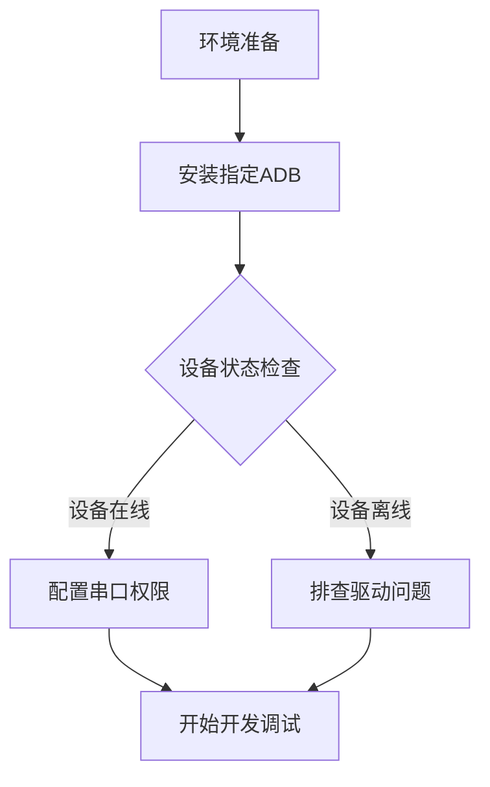

# 嵌入式开发环境搭建指南

## 📌 环境搭建注意事项

### ADB 安装避坑指南

**因网络环境复杂，建议通过指定源安装稳定版 ADB**  

#### 安装前准备
```bash
# 添加阿里云 Ubuntu 16.04(Xenial) 源
cat << EOF | sudo tee /etc/apt/sources.list.d/android-xenial.list
deb http://mirrors.aliyun.com/ubuntu/ xenial main restricted universe multiverse
deb-src http://mirrors.aliyun.com/ubuntu/ xenial main restricted universe multiverse

deb http://mirrors.aliyun.com/ubuntu/ xenial-updates main restricted universe multiverse
deb-src http://mirrors.aliyun.com/ubuntu/ xenial-updates main restricted universe multiverse

deb http://mirrors.aliyun.com/ubuntu/ xenial-security main restricted universe multiverse
deb-src http://mirrors.aliyun.com/ubuntu/ xenial-security main restricted universe multiverse
EOF
```

#### 安装流程
```bash
# 更新源列表
sudo apt-get update && sudo apt-get upgrade -y

# 安装指定版本 ADB
sudo apt-get install android-tools-adb=1:8.1.0+r23-5~18.04

# 验证安装
adb version
# 正确版本输出：
# Android Debug Bridge version 1.0.39
# Version 1:8.1.0+r23-5~18.04
# Installed as /usr/lib/android-sdk/platform-tools/adb
```

#### 错误版本警示
```bash
# ❌ 错误版本示例
Android Debug Bridge version 1.0.32
```

---

### 设备连接异常处理

#### 常见报错现象
```bash
# 设备无权限识别
List of devices attached 
????????????	no permissions
????????????	no permissions
```

#### 解决方案
```bash
# 1. 杀死残留进程
adb kill-server

# 2. 以管理员权限重启服务
sudo adb start-server

# 3. 重新检测设备
adb devices
```

---

### 串口通信权限配置

#### 报错案例
```python
# 串口访问被拒绝
SerialException: [Errno 13] could not open port /dev/ttyUSB9: [Errno 13] Permission denied: '/dev/ttyUSB9'
```

#### 权限修复
```bash
# 将当前用户加入 dialout 组
sudo usermod -a -G dialout $USER

# 退出并重新登录使配置生效
```

---

## 🔧 开发流程示意图



## ⚠️ 关键注意事项

1. **版本兼容性**  
   - 推荐使用 Android SDK Platform-Tools v29+ 版本
   - 避免使用 apt 安装的最新版（可能存在内核兼容问题）

2. **权限持久化**  
   ```bash
   # 在 /etc/udev/rules.d/ 添加自定义规则
   echo 'SUBSYSTEM=="tty", ATTRS{idVendor}=="18d1", ATTRS{idProduct}=="4ee1", GROUP="dialout", MODE="0666"' | sudo tee /etc/udev/rules.d/99-android.rules
   ```

3. **安全建议**  
   - 定期清理无用 USB 规则文件
   - 开发完成后移除非必要用户组权限
```
